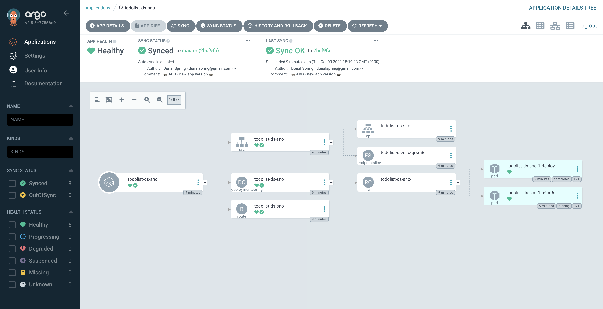

## Notes on linking ACM to ARGOCD
mostly [nabbed from here](https://piotrminkowski.com/2022/10/24/gitops-with-advanced-cluster-management-for-kubernetes/)

## pre req:

1. Deploy ACM 
2. Deploy ArgoCD cluster edition to the same hub

## Deploying an app to a managed cluster set in ACM / ArgoCD

1. Create a ManagedClusterSet:
```bash
oc apply -f 1_ManagedClusterSet.yaml
```

2. Add exising clusters to the set by providing the label:
```bash
oc label managedcluster $CLUSTER_NAME cluster.open-cluster-management.io/clusterset=$NAME
# eg
oc label managedcluster local-cluster cluster.open-cluster-management.io/clusterset=demo --overwrite=true
oc label managedcluster ds-sno cluster.open-cluster-management.io/clusterset=demo --overwrite=true

# additional labels
oc label managedcluster local-cluster env=dev --overwrite=true
oc label managedcluster ds-sno env=prod --overwrite=true
```

3. We need to bind managed clusters to the target namespace where Argo CD is deployed. Create this:
`oc apply -f 2_ManagedClusterSetBinding.yaml`

4. Create the placement - can be complex with labels within a selected cluster set as per the example or just the whole cluster set:
`oc apply -f 3_Placement.yaml` 
to verify:
`oc get placement -n openshift-gitops`

5. Create the GitOpsCluster which results in new clusters being available in ArgoCD and permissions associated with each:
`oc apply -f 4_GitOpsCluster.yaml` 
verify:
`oc get gitopscluster demo-gitops-cluster -n openshift-gitops -o=jsonpath='{.status.message}'`

6. Verify you can see them in the UI of ArgoCD.... 
NEED TO BE AN ADMIN to see this stuffs (`oc extract secrets/openshift-gitops-cluster --keys=admin.password -n openshift-gitops --to=-`)


7. Run the test deployment to see the app deployed across each cluster `oc apply -f 5_TEST_deployment.yaml`


8. BONUS POINTS - play around with the `3_Placement.yaml` to move apps between clusters 