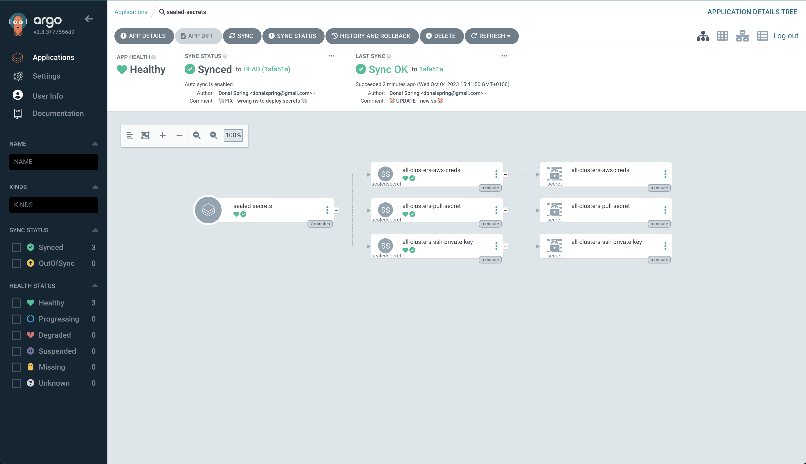

# GitOps deployment of SNO clusters 
using sealed secrets to keep info safe and using a single namespace for all provisioned clusters as a workaround to having multiple copies of all the secrets. The instructions below 

## SETUP - USING SEALED SECRETS 
1. login to ocp (might need `--insecure-skip-tls-verify=true` if in demo dot redhat envs) ... 
```bash
oc login  ... 
```

2. Install SealedSecrets in a namespace eg `labs-ci-cd`.
```bash
helm repo add sealed-secrets https://bitnami-labs.github.io/sealed-secrets
helm install my sealed-secrets/sealed-secrets -f sealedsecrets/values.yaml -n labs-ci-cd --create-namespace
```

3. create a `secrets.yaml` file containing the values needed as per the example at the end of the `values.yaml`
```yaml
secrets:
  aws_access_key_id: 'changeme'
  aws_secret_access_key: 'changeme'
  pullSecret: 'changeme'
  sshPrivateKey: 'changeme'
```

4. Generate Secret files from these values and given `CLUSTER_NAME` and store in tmp for now:
```bash
export CLUSTER_NAME=blerg
helm template -f secrets.yaml --set sealedSecrets=false --set cluster.name=$CLUSTER_NAME -s templates/secrets/all.yaml sno > /tmp/all.yaml
```

5. Seal the secrets for your new CLUSTER_NAME.
```bash
kubeseal < /tmp/all.yaml > sealedsecrets/$CLUSTER_NAME-sealed-secrets.yaml \
    -n $CLUSTER_NAME \
    --controller-namespace labs-ci-cd \
    --controller-name sealed-secrets \
    -o yaml
```

6. Commit the encrypted values to git. ENSURE you don not check in your AWS creds by accident (like i did first time)
`git add sealedsecrets` && `git commit ...`

7. Generate your Application resource in ArgoCD to sync the secrets to teh cluster 
```bash
# dirty hack - should define proper roles / resps for the ArgoCD service account
oc adm policy add-cluster-role-to-user cluster-admin system:serviceaccount:openshift-gitops:openshift-gitops-argocd-application-controller

oc apply -f SealedSecretsApp.yaml
```

